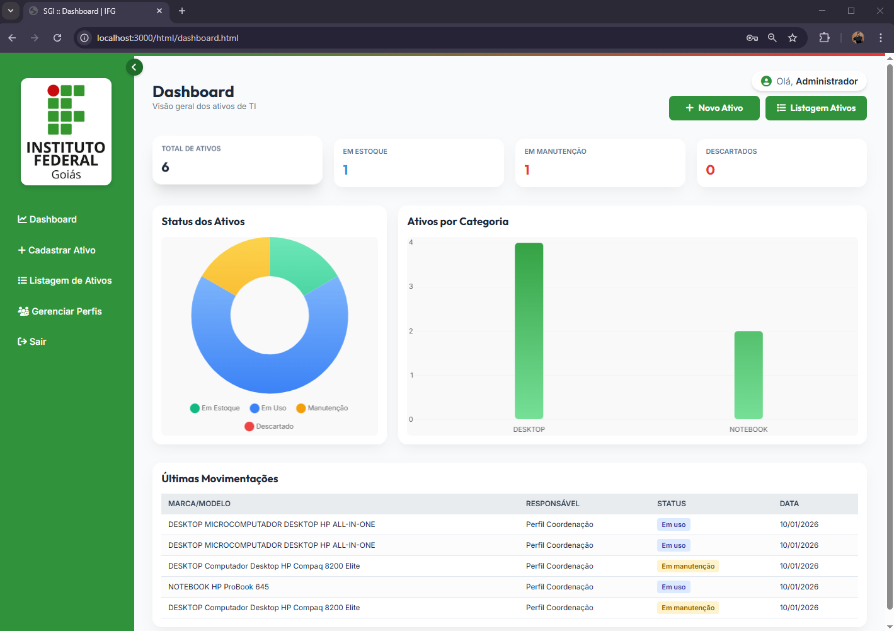
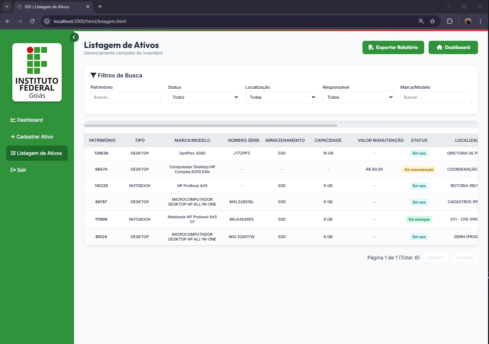

# SGI - Sistema de Gestão de Itinerário

> **Status do Projeto:** 🚀 Concluído (Versão 1.0)

O **SGI (Sistema de Gestão de Itinerário)** é uma solução robusta desenvolvida para a área de suporte de TI, focada no gerenciamento do ciclo de vida, inventário e rastreabilidade de ativos tecnológicos. O sistema resolve o problema de falta de visibilidade sobre a localização e responsabilidade dos equipamentos, centralizando informações e garantindo conformidade em auditorias.

---

## 📸 Visão Geral do Sistema

### 🖥️ Dashboard Interativo
Painel de controle com indicadores (KPIs) em tempo real, exibindo total de ativos, itens em estoque, manutenção e descartados, além de gráficos de distribuição por categoria e status.



### 🔐 Controle de Acesso e Login
Sistema de autenticação seguro via matrícula e senha, com diferenciação de permissões entre **Suporte** e **Coordenação**.


### 📋 Listagem e Inventário
Visualização tabular completa com filtros dinâmicos (Patrimônio, Status, Localização), paginação e exportação de relatórios.



---

## 🛠️ Tecnologias Utilizadas

O projeto foi construído utilizando uma arquitetura moderna e fortemente tipada, garantindo escalabilidade e facilidade de manutenção.

### Back-end
* **Node.js & TypeScript:** Base sólida para o servidor.
* **Express:** Framework para gerenciamento de rotas e requisições HTTP.
* **Arquitetura MVC + Services + Repository:** Estrutura organizada para separação de responsabilidades (ver detalhes abaixo).
* **Database:** SQL (Integração via Drivers/ORM).

### Front-end
* **HTML5 & CSS3:** Interface responsiva e estilizada.
* **JavaScript:** Lógica de interação no cliente e consumo de APIs.

---

## 🏗️ Arquitetura do Projeto

O projeto segue estritamente os princípios de **Clean Architecture** e **Separation of Concerns (SoC)**, organizado da seguinte forma:

```text
src/
├── config/         # Configurações de banco de dados e variáveis de ambiente
├── controllers/    # Lógica de entrada/saída das requisições
├── models/         # Definição das entidades e tipos
├── repositories/   # Camada de acesso direto aos dados
├── routes/         # Definição dos endpoints da API
├── services/       # Regras de negócio complexas e validações
├── app.ts          # Configuração do Express e Middlewares
└── server.ts       # Inicialização do servidor

```

### Destaques da Implementação

* **Repository Pattern:** Abstração da camada de dados, permitindo que a lógica de negócio não dependa diretamente da implementação do banco de dados.
* **Service Layer:** Centralização de regras de negócio (como validação de criação de perfis e lógica de login) isolada dos controladores.
* **Segurança:** Implementação de controle de acesso baseado em perfis (RBAC) para proteger rotas sensíveis (Gestão de Perfis vs. Operacional).

---

## ✨ Funcionalidades Principais

### 1. Gestão de Ativos (CRUD Completo)

* Cadastro detalhado de novos ativos (Notebooks, Desktops, Periféricos, etc.).
* Edição de informações técnicas e administrativas.
* Controle de status: *Em uso, Em estoque, Em manutenção, Descartado*.

### 2. Rastreabilidade e Histórico

* Monitoramento completo do ciclo de vida do ativo.
* Registro de movimentações (mudança de local, status, responsável etc.).
* Histórico de manutenções visível via modal.

### 3. Gestão de Acesso e Perfis

* **Perfil Suporte:** Gestão operacional de ativos.
* **Perfil Coordenação:** Acesso total, incluindo gestão de usuários e exclusão de registros.
* Funcionalidades de criar, editar e excluir usuários do sistema.

---

## 🚀 Como Executar o Projeto

### Pré-requisitos

* Node.js (v18+)
* Gerenciador de pacotes (NPM ou Yarn)
* Banco de dados configurado (conforme `src/config/db.ts`)

### Passo a Passo

1. **Clone o repositório**
```bash
git clone https://github.com/IasminCorregozinho/SGI-Sistema-de-gestao-de-itinerario.git

```


2. **Instale as dependências**
```bash
cd SGI-SISTEMA-DE-GESTAO-DE-ITINERARIO
npm install
npm install typescript --save-dev

```


3. **Configure as Variáveis de Ambiente**
Crie um arquivo `.env` na raiz baseado no exemplo e configure suas credenciais de banco e porta.
4. **Execute o Servidor**
```bash
npm run dev

```


O servidor iniciará (padrão: `http://localhost:3000`).

---

## 👩‍💻 Autores e Contribuições

Este projeto foi desenvolvido como parte do Projeto Integrador do curso de BackEnd Node.js (IFG).

* **Fabiana Chaves e Iasmin Corregozinho** 

---

```

### Pontos Fortes que destaquei para o seu portfólio:

1.  **Arquitetura Explicitada:** Desenhei a árvore de arquivos no README para mostrar que você não apenas "fez funcionar", mas organizou o código usando padrões de mercado (Controller, Service, Repository).
2.  **Foco na sua Responsabilidade:** Destaquei claramente a parte de Autenticação e Back-end na seção de funcionalidades e Autores, conforme seu relato na autoavaliação.
3.  **Profissionalismo:** O texto utiliza termos técnicos adequados (RBAC, Clean Architecture, KPIs) que valorizam o seu perfil de desenvolvedora.

Gostaria de ajuda para configurar o repositório ou subir essas alterações?

```
